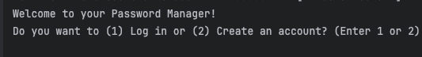
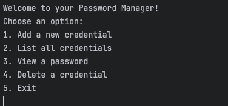
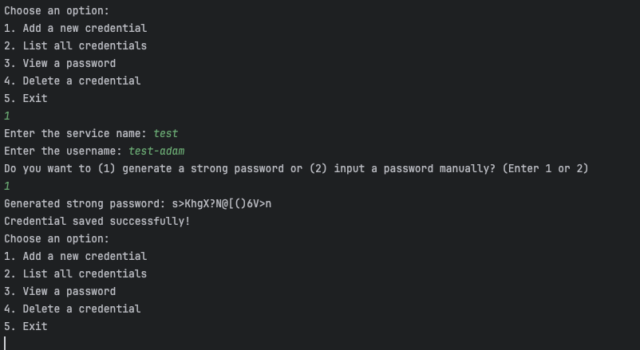
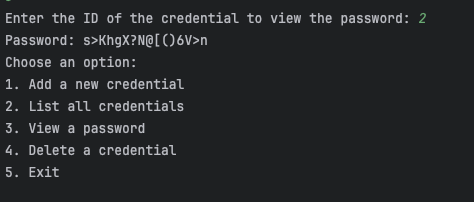

# Password Manager

This is a password manager app built using Spring Boot and Kotlin. 
It stores your service credentials (service name, username, and password) on a local SQLite database. 
The passwords in credentials are encrypted using the AES-GCM algorithm, and each user has a master password that is used to unlock their stored credentials.

I focused more on services rather than user interface. I've built a simple CLI app to demonstrate them.

## Setup Instructions

### Prerequisites:
- Java 21
- Spring Boot
- SQLite

### How to Run the Application:
1. **Clone the repository:**
   ```bash
   git clone <repository-url>
   ```

2. **Navigate to the project directory:**
   ```bash
   cd password-manager
   ```

3. **Build and run the application:**
   ```bash
   ./gradlew bootRun
   ```

4. Use the command-line interface (CLI) to interact with the password manager. You can create a user account, add credentials, view passwords, and delete credentials.


### Screenshots:








## Security Model

### Encryption:
- Passwords are encrypted using AES-GCM (Galois/Counter Mode) to provide both confidentiality and integrity.
- Each credential is encrypted with a key derived from the master password and a unique salt for each credential.
- The master password is hashed using PBKDF2 with a per-user salt and 65536 iterations to mitigate brute-force attacks on stored passwords.

### Key Handling:
- The master password is never stored directly in the database. Instead, it is used to derive encryption keys and is hashed for authentication.
- A new salt is generated for each credential and stored alongside the encrypted password.
- The derived encryption key is only kept in memory during encryption and decryption operations.

## Pitfalls and Limitations:

### CLI Password Exposure:
- When the user inputs any password, it is visible in plain text in the CLI.

### Sensitive Data in Memory:
- The master password is stored in memory for longer than necessary. This creates a risk if an attacker gains access to a memory dump. We should explicitly nullify the master password after it’s no longer needed.

### Brute Force Attacks:
- There is currently no rate-limiting for login attempts, meaning attackers could theoretically brute-force the master password. Implementing rate limiting or delays after failed attempts could help mitigate this.

### Weak Master Passwords:
- If users choose weak master passwords, this compromises the overall security of the encryption. The system could enforce stronger password policies to mitigate this risk.

## Security Discussion

### Threat Model:

#### External Attackers:
- Attackers who manage to access the local machine or the SQLite database might attempt to retrieve stored credentials. The encryption ensures that even if the database is compromised, the attacker cannot decrypt the passwords without the master password.

#### Insider Threats:
- If someone with physical access to the machine retrieves a memory dump while the application is running, they could extract the master password or decrypted credentials.

#### Database Attacks:
- If the SQLite database is compromised, all encrypted credentials and salts are available. However, without the master password, the encrypted credentials remain secure.

### Mitigations:
- **Encryption**: AES-GCM ensures that even if the encrypted data is accessed, it cannot be decrypted without the master password.
- **Key Derivation**: The PBKDF2 function with a unique salt per user strengthens resistance to brute force and dictionary attacks.
- **Data in Memory**: Sensitive data like the master password and decrypted passwords should be explicitly cleared from memory after use to mitigate risks of memory scraping attacks.
- **Rate Limiting**: Consider adding rate-limiting mechanisms to prevent brute-force attempts on the master password.
- **Masked Password Input**: In future versions, consider using a mechanism to mask password input in the CLI to prevent exposure.
